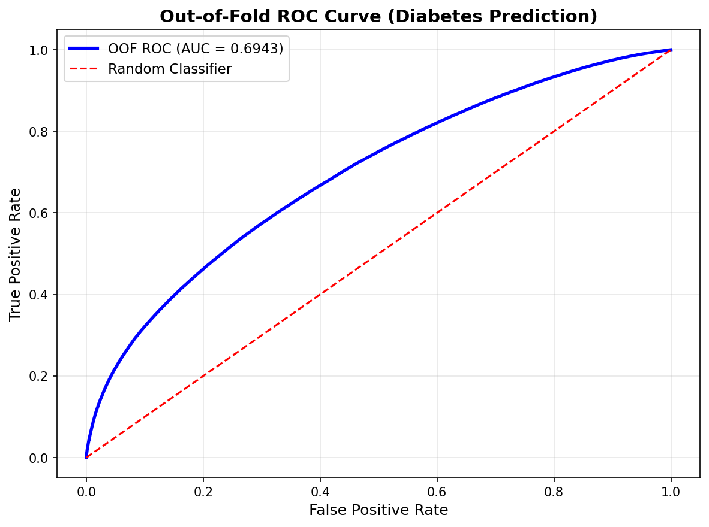

# Diabetes Risk Predictor

**A simple, interpretable, AI-powered tool to estimate an individual's risk of diabetes based on lifestyle, medical, and demographic factors.**

Built with Python, scikit-learn and Streamlit. The model is a **logistic regression pipeline** trained on a large dataset (700,000 samples). The project focuses on clarity, reproducibility, and explainability — *not* medical diagnosis.

## 🚀 Live Demo

👉 **Try the app here:**  
[](https://diabetes-risk-prediction-application.streamlit.app/)

---

## 🔹 Quick Features

* Predicts the **probability of diabetes** for a single person.
* Returns a **risk category**: Low / Medium / High.
* Shows **top positive / negative feature contributions** for that individual.
* Clean UI with **tooltips** that explain medical terms in plain language.
* **Downloadable professional PDF report** summarizing the prediction and top factors.
* Reproducible evaluation with out-of-fold ROC and saved metrics.

## 🧪 Model Performance (Out-of-Fold, 5-fold Stratified CV)

| Metric    | Value  |
| --------- | ------ |
| ROC-AUC   | 0.6943 |
| Accuracy  | 0.6633 |
| Precision | 0.6813 |
| Recall    | 0.8640 |
| F1-score  | 0.7618 |

**Confusion Matrix (OOF preds):**

```
[[ 87329 176364 ]
 [ 59330 376977 ]]
```

**Notes**

* ROC-AUC ≈ 0.69 — useful for ranking risk but not perfectly separable.
* Recall is high (~86%), so the model captures most positives (useful for screening).
* Precision is moderate (~68%), so expect some false positives.
* These metrics come from out-of-fold predictions (`model/metrics_report.json`). See the Evaluation section below.

## 🧩 Inputs in the Web App

**Continuous Features** (hover-help + typical ranges shown on hover):

| Feature             | Short description                            | Typical range |
| ------------------- | -------------------------------------------- | ------------- |
| Age                 | Age in years                                 | 18–100        |
| Alcohol consumption | Standard drinks/week                         | 0–50          |
| Physical activity   | Minutes/week of moderate+ activity           | 0–2000        |
| Diet score          | 0 (poor) → 10 (excellent)                    | 0–10          |
| Sleep hours         | Average hours per day                        | 0–16          |
| Screen time         | Daily non-work screen time (hours)           | 0–20          |
| BMI                 | Body Mass Index (kg/m²) — healthy: 18.5–24.9 | 10–60         |
| Waist-to-hip ratio  | Fat distribution indicator                   | 0.3–1.5       |
| Systolic BP         | Top blood pressure number (mmHg)             | 70–220        |
| Diastolic BP        | Bottom blood pressure number (mmHg)          | 40–140        |
| Heart rate          | Resting beats per minute                     | 30–200        |
| Total cholesterol   | mg/dL                                        | 80–400        |
| HDL                 | "Good" cholesterol mg/dL                     | 10–200        |
| LDL                 | "Bad" cholesterol mg/dL                      | 10–300        |
| Triglycerides       | mg/dL — normal <150, high ≥200               | 10–1000       |

**Binary features (checkboxes):**

* Family history of diabetes
* Hypertension history
* Cardiovascular history

**Categorical (dropdowns, user-friendly labels):**

* Gender, Ethnicity, Smoking status, Employment status, Education level, Personal income level

> Hover on any input to see a short explanation and typical ranges. The UI avoids jargon and presents plain language help.

---

## 🔹 How it works (brief)

1. You provide values for the inputs in the sidebar.
2. Click **Predict Risk**.
3. The app returns:

   * Predicted probability (0–100%).
   * Risk category: Low / Medium / High.
   * Top positive contributors (features that increased the score).
   * Top negative contributors (features that decreased the score).
4. Optionally download a **professional PDF report** containing the prediction, key charts, and input summary.

---

## 🖼 Screenshots & Visuals (what to include)

Place these files in the `screenshots/` folder. Reference them in the README and on your GitHub page.

Required screenshots (recommended filenames):

* `screenshots/image_1.png`
* `screenshots/image_2.png` 
* `model/oof_roc_curve.png` — Out-of-fold ROC curve (see Evaluation below).
* `screenshots/diabetes_report.pdf` — preview of the generated PDF report.

Add this section just after Model Details if you want the ROC embedded:

```markdown
### ROC Curve (Out-of-Fold)

The ROC below is computed from out-of-fold predictions across 5 stratified folds. It demonstrates the model's ranking ability without leaking training data.


```

---

## 🏗 Project structure

```
Diabetes_Prediction_Project/
│
├─ app.py                    # Streamlit app (inference-only)
├─ evaluate_model.py         # Script to compute metrics & OOF ROC
├─ model/
│  ├─ diabetes_pipeline_v1.pkl
│  ├─ feature_importance_coefficients.csv
│  └─ metrics_report.json    # produced by evaluate_model.py
├─ data/
│  ├─ train.csv
│  └─ test.csv
├─ screenshots/
│  ├─ app_sidebar_inputs.png
│  ├─ prediction_results.png
│  ├─ feature_contributions.png
│  ├─ oof_roc_curve.png
│  └─ diabetes_report.pdf
├─ requirements.txt
└─ README.md
```

---

## ⚡ Run locally (step-by-step)

1. Clone repo and cd into it:

```bash
git clone <your-repo-url>
cd Diabetes_Prediction_Project
```

2. Create virtual env (recommended) and install deps:

```bash
python -m venv venv
# macOS / Linux
source venv/bin/activate
# Windows
# venv\Scripts\activate

pip install -r requirements.txt
```

> If you added PDF export, ensure `reportlab` is in `requirements.txt`.

3. Run Streamlit app:

```bash
streamlit run app.py
```

4. Open browser at `http://localhost:8501`.

---

## 🔬 Evaluate model & regenerate ROC (how I computed the numbers)

Run the provided evaluation script to reproduce the reported metrics (out-of-fold):

```bash
python evaluate_model.py
```

Outputs:

* `model/metrics_report.json` — OOF metrics and classification report (already created in your run).
* `model/oof_roc_curve.png` — Out-of-fold ROC curve image (move or copy to `screenshots/oof_roc_curve.png` for README).

**To include ROC in the repository**:

```bash
cp model/oof_roc_curve.png screenshots/oof_roc_curve.png
```

---

## ⚖️ Legal & Ethical Disclaimer (must include)

**Important:** This tool is for educational and informational purposes only. It is **not** a medical diagnostic device and should **not** be used as a substitute for professional medical advice, diagnosis, or treatment. Always consult a qualified healthcare provider for any medical concerns.

---
